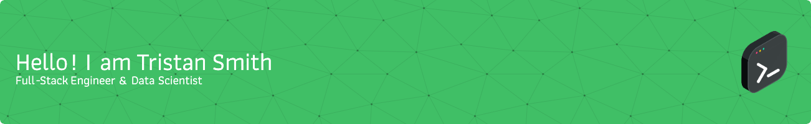

### A Full-Stack Engineer & Data Scientist crafting scalable, elegant solutions that bridge intuitive UX with powerful backend systems. Passionate about turning complex problems into clean, efficient code.
 

- 🔭 I currently work at **[PILYTIX](https://pilytix.ai/)**, where I lead full-stack development and data science initiatives to power predictive models and CDP-driven marketing solutions for major sports teams, university foundations, and live entertainment venues. My work spans scalable infrastructure, custom lead scoring algorithms, and AI-powered engagement tools

- 🌱 Always learning — pursuing MongoDB Associate Developer (Python & Node.js) and AWS Cloud Practitioner certifications

- 📜 Certified in Docker Foundations, Tableau Desktop Specialist, Microsoft Excel Expert, Julia & R Programming, Big Data SQL, and full-stack web technologies including TypeScript, React, and JavaScript
  
- 💬 Ask me about **React, TypeScript, Python, or building full-stack systems from scratch**
  
- 🧠 On the side: I write about tech, build weird MVPs, and chase predictive modeling in sports analytics

 

  
  
  
  

## 🛠️ Languages and Tools

 

  
   
  

